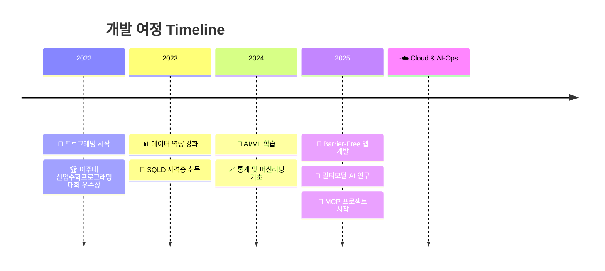

#  안녕하세요! 정진호입니다.

<div align="center">
  
</div>

<div align="center">
  <a href="mailto:jungjin03@ajou.ac.kr">
    
  </a>
  <a href="https://github.com/alphabeen">
    
  </a>
  
</div>

## 🎓 About Me

```python
class JinhoJung:
    def __init__(self):
        self.name = "정진호"
        self.university = "아주대학교"
        self.major = ["수학과", "인공지능융합학과"]
        self.interests = ["AI/ML", "Cloud Automation", "Data Analysis", "Time Series"]
        self.current_project = "MCP - Multi-Context Predictive AI-Ops Platform"
        
    def say_hi(self):
        print("수학적 사고로 지능형 시스템을 설계하는 엔지니어입니다 👨‍💻")
```

## 💻 Tech Stack

### Languages & Frameworks
<div align="center">
  
  
  
  
  
</div>

### AI/ML & Data Science
<div align="center">
  
  
  
  
  
</div>

### Backend & Cloud
<div align="center">
  
  
  
  
  
</div>

### Frontend & Mobile
<div align="center">
  
  
  
  
</div>

## 🚀 Featured Projects

<table>
  <tr>
    <td width="50%">
      <h3 align="center">🧩 MCP Platform</h3>
      <div align="center">
        <a href="https://github.com/MCP-AI-Ops/MCP_AI_Ops">
          
        </a>
        <p>
          <strong>AI-Ops 자동 배포 플랫폼</strong><br/>
          LSTM 기반 24시간 리소스 예측<br/>
          IsolationForest 이상 탐지<br/>
          FastAPI + Docker 오케스트레이션
        </p>
      </div>
    </td>
    <td width="50%">
      <h3 align="center">🗣️ The쉬운말로</h3>
      <div align="center">
        <br/><br/>
        <p>
          <strong>문해력 지원 앱</strong><br/>
          GPT 기반 문장 단순화<br/>
          Barrier-Free App Contest 참가<br/>
          Flutter + FastAPI
        </p>
      </div>
    </td>
  </tr>
  <tr>
    <td width="50%">
      <h3 align="center">🚇 Silent Subway</h3>
      <div align="center">
        <br/><br/>
        <p>
          <strong>청각·시각 장애인 지하철 안내</strong><br/>
          실시간 지하철 정보 연동<br/>
          진동/점자/최소시각 UI<br/>
          Android Accessibility API
        </p>
      </div>
    </td>
    <td width="50%">
      <h3 align="center">📚 LibraryAI</h3>
      <div align="center">
        <br/><br/>
        <p>
          <strong>도서관 데이터 분석 시스템</strong><br/>
          TF-IDF + TextRank 키워드 추출<br/>
          폐기점수 예측 모델<br/>
          도서관정보나루 API 연동
        </p>
      </div>
    </td>
  </tr>
</table>

## 📈 My Journey



## 🏆 Achievements

<div align="center">
  
| Year | Achievement | Organization |
|:----:|:------------|:-------------|
| 2022 | 🥈 **산업수학프로그래밍 대회 우수상** | 아주대학교 |
| 2023 | 📜 **SQLD 자격증** | 한국데이터산업진흥원 |
| 2025 | 🎓 **파란학기제 MCP 프로젝트** | 아주대학교 |

</div>

## 📊 GitHub Analytics

<div align="center">
  
  
</div>

<div align="center">
  
</div>

## 🌟 Philosophy

<div align="center">
  
</div>

> ### 💭 My Development Principles
> - **📐 Mathematical Thinking**: 수학적 엄밀함으로 시스템을 설계합니다
> - **📊 Data-Driven**: 데이터가 모든 결정의 근거가 됩니다
> - **🔄 Continuous Learning**: 실패는 더 나은 해결책을 찾는 과정입니다
> - **🤝 Collaboration**: 혼자 가면 빨리 가지만, 함께 가면 멀리 갑니다

---

<div align="center">
  
  
  **"배포는 빠르게, 예측은 더 똑똑하게 — That's the MCP way."**
  
  <br/>
  
  *Feel free to reach out for collaborations or just a friendly chat!* 😊
</div>